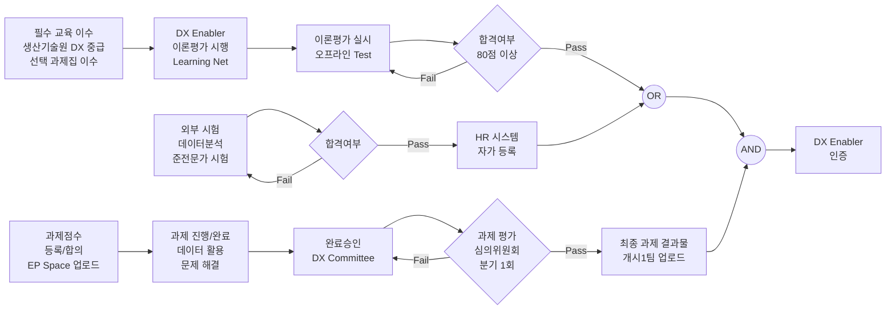
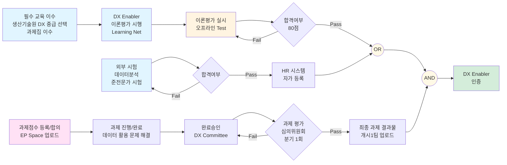

# Extracted Knowledge from Conv: 0f9466bb-79d5-44e2-bdc7-4ca348f35602

**Date**: 2026-01-26T23:47:39.751100Z

### Extracted Code (mermaid)



### Extracted Code (mermaid)



### Extracted Code (mermaid)


### Extracted Code (mermaid)

```mermaid
style A fill:#e1f5ff,stroke:#0066cc,stroke-width:2px
style O fill:#d4edda,stroke:#28a745,stroke-width:3px
style H fill:#fff9e6,stroke:#ffc107,stroke-width:2px
style N fill:#fff9e6,stroke:#ffc107,stroke-width:2px
```

### Extracted Code (text)

```text
1. Canva → "Whiteboard" 선택
2. 좌측 "Elements" → "Flowchart" 카테고리
3. 미리 만들어진 플로우차트 요소 드래그
4. 연결선으로 요소 연결
```

### Extracted Code (text)

```text
왼쪽 → 오른쪽 흐름으로 배치:

[필수교육] → [이론평가] → [OR] → [AND] → [인증]
              ↓          ↗
           [외부시험]   
           
           [과제평가] → [AND]
```
